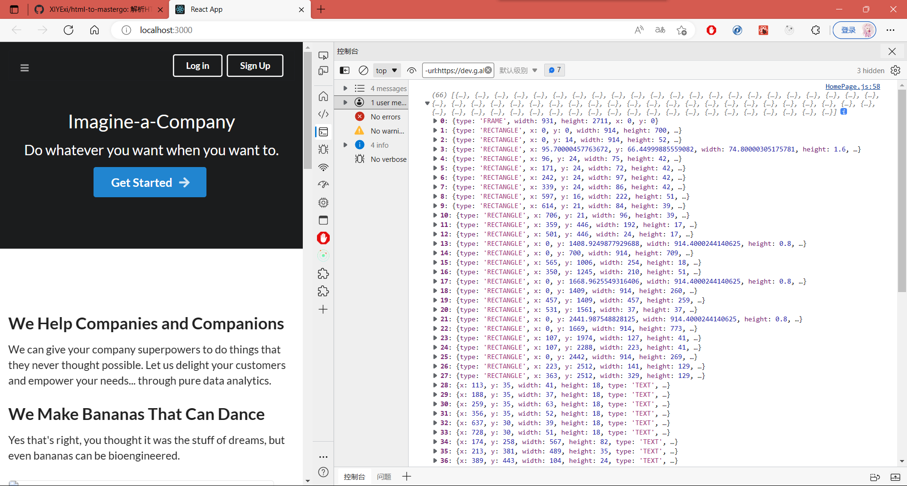
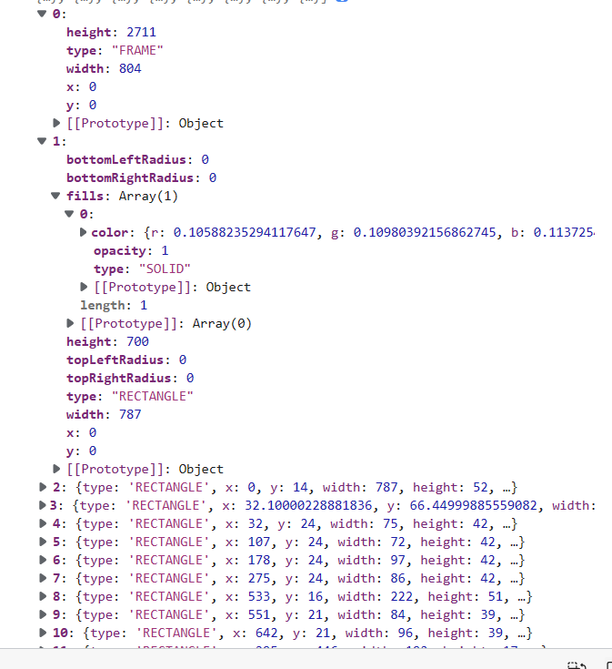
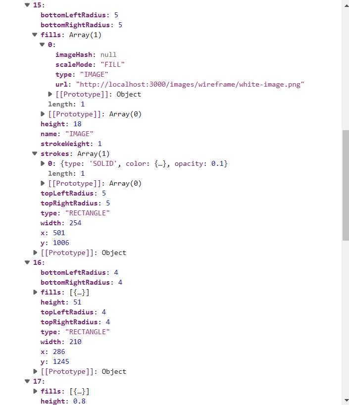

# 使用说明捏

```js
htmlToMastergo('body', location.hash.includes("useFrames=true"));
```

## lib
本插件通过解析html结构，判断css样式，来生成对应的节点数据，并生成MasterGo设计稿，从而实现html-to-mastergo的效果。

在 `lib` 文件中 `html-to-mastergo` 为解析 html 文件的核心依赖，`lib` 文件下 `inject.js` 为最终暴露出去的接口，
原理为运行时侵入，需要在目标网页渲染完毕后通过手动的方式进行爬取。


## ```layer\HomePage```
此文件中展示的是在另一个项目中的使用测试，测试项目是使用create-react-app构建，使用Semantic-UI-React官方模板，通过点击
`<Button></Button>`成果触发。

需要注意的是，layer中只是演示，演示项目环境是react，但是lib中的核心依赖不依赖任何js脚本和框架，可以在任何情况下使用。


在 `layer\HomePage.js` 中是关于使用的一种案例：
```jsx
<Button primary size='huge' onClick={()=>{
    // eslint-disable-next-line no-restricted-globals
    const layers = htmlToMastergo('body', location.hash.includes("useFrames=true"));
    console.log(layers);
}}>
    Get Started
    <Icon name='right arrow' />
</Button>
```

通过上述方式触发，如果直接通过脚本注入，可能会发生 ```Array.form 不是一个函数``` 之类的问题。

## Ts
本项目没用使用ts，只是单纯的因为建文件夹的时候忘选择typescript，后续可能会增加声明文件。

## 基本说明
触发成功后 ( ***目前*** ) 会在控制台打印节点数据



- FRAME 表示当前网页实际视窗宽度和高度，会受到浏览器缩放和控制台的影响！
- RECTANGLE 表示一个区块元素，可以理解为一个组件的最外层div
- TEXT 文字

所有组件都存在

```ts
interface IJson {
    x: number;
    y: number;
    width: width;
    height: height;
    type: string;
    bottomLeftRaduis: number;
    bottomRightRadius: number;
    topLeftRadius: number;
    topRightRadius: number;
    fills: {
        color?: {r: number; g: number; b: number;};
        opacity?: number;
    }[]
    [key:string]: any;
}
```

部分展示图：


x，y表示到viewport的距离，width和height就是区块的渲染长宽，之后四个radius你们应该看得懂，
fills并不绝对，上述interface中写出的表示border的填充，对应```border: 1px solid #fff``
这种类型的写法，以上写法并不绝对，同时interface也不全。


因为也可能出现以下情况:


具体需要使用和详细手册需要等到我给出文档捏。
